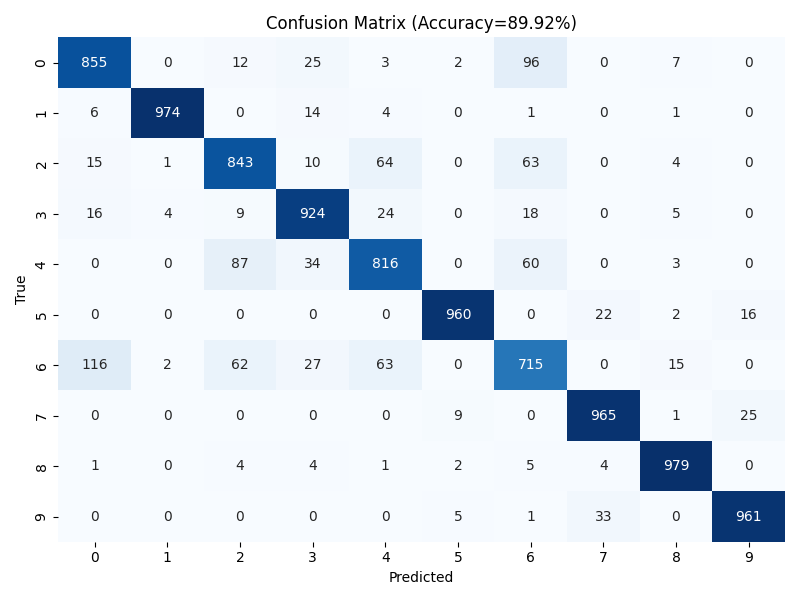
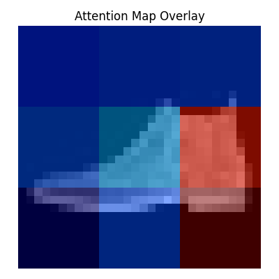

# 🧠 Vision Transformer (ViT) on Fashion-MNIST  
**Author:** Pawan Sharma  
**Roll Number:** 22053329  
**Dataset:** Fashion-MNIST  
**Framework:** PyTorch  

---

## 📘 Overview  
This project implements a **Mini Vision Transformer (ViT)** from scratch — without using any pretrained models — as part of the “Transformers Assignment”.  
The model is trained on the **Fashion-MNIST** dataset to classify different clothing categories such as shirts, sneakers, trousers, and more.  

The implementation covers:
- Manual patch embedding and positional encoding  
- Multi-head self-attention and MLP blocks  
- Layer normalization and residual connections  
- End-to-end training and evaluation pipeline  

---

## ⚙️ Roll-Number Based Hyperparameters  
| Parameter | Formula | Value (for Roll 22053329) |
|------------|----------|---------------------------|
| `seed` | last two digits | **29** |
| `hidden_dim` | 128 + (29 % 5) * 32 | **256** |
| `num_heads` | 4 + (29 % 3) | **6** |
| `patch_size` | 8 + (29 % 4) * 2 | **10** |
| `epochs` | 10 + (29 % 5) | **14** |

---

## 🧩 Project Structure  
```
VisionTransformer-Assignment/
├── vit_fashionmnist_partB.py         # Model training and implementation
├── vit_fashionmnist_partC_fixed.py   # Evaluation, plots, attention visualization
├── outputs_partB/
│   ├── model_best.pt
│   └── logs.csv
├── outputs_partC_fixed/
│   ├── accuracy_curve.png
│   ├── confusion_matrix.png
│   ├── attention_map.png
│   └── report.txt
└── Vision_Transformer_Assignment_Report_Pawan_Sharma.docx
```

---

## 🧠 Model Summary  
The Mini ViT model was trained for 14 epochs using the **AdamW optimizer** with cosine learning rate scheduling.  
It achieved a **final test accuracy of 89.92%**, demonstrating that even a compact ViT architecture can perform competitively with CNNs on small-scale vision tasks.

---

## 📊 Results and Visualizations  
- **Accuracy Curve:** Training and validation accuracies increased smoothly with no signs of overfitting.  
- **Confusion Matrix:** Clear diagonal dominance with minimal misclassifications.  
- **Attention Map:** Model focuses on key object regions (edges, collars, soles), showing interpretable spatial attention.  

<p align="center">
  
  
  
</p>

---

## 🧾 Conclusion  
The Mini Vision Transformer successfully learns discriminative representations from scratch.  
Its multi-head attention mechanism enables region-specific feature extraction, and the chosen patch size ensures a strong balance between local texture detail and efficiency.  
This demonstrates that ViTs, even at small scale, can achieve **CNN-level performance** when properly tuned.

---

## 🧰 Requirements  
Install dependencies:
```bash
pip install torch torchvision matplotlib seaborn scikit-learn
```

Run training:
```bash
python vit_fashionmnist_partB.py
```

Run evaluation and analysis:
```bash
python vit_fashionmnist_partC_fixed.py
```

---

## 🏁 Acknowledgements  
- Dataset: [Fashion-MNIST](https://github.com/zalandoresearch/fashion-mnist)  
- Architecture inspired by *“An Image is Worth 16x16 Words” (Dosovitskiy et al., 2020)*  
- Implementation and analysis authored by **Pawan Sharma**
